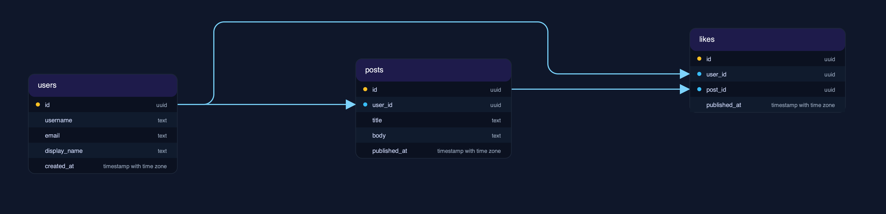

# WizERD Documentation

WizERD is a powerful PostgreSQL ER diagram generator that transforms your database schema into beautiful, readable diagrams with zero table overlap and minimal edge crossings.

## Features

- **Zero Overlap** — Tables never render on top of each other
- **Smart Routing** — Minimal relationship line crossovers for maximum readability
- **14 Built-in Themes** — From dark mode to minimal, find your perfect style
- **Flexible Spacing** — Compact, standard, or spacious layouts
- **Column-level Details** — Shows data types, primary keys, and foreign keys
- **Configurable** — YAML configs, environment variables, or CLI flags

## Quick Links

- [Installation](installation.md)
- [Getting Started](getting-started.md)
- [Configuration](configuration.md)
- [Themes](themes.md)
- [Spacing Profiles](spacing-profiles.md)
- [Examples](examples.md)
- [CLI Reference](cli-reference.md)

## Why WizERD?

Most ER diagram generators fail with large databases (100+ tables). They produce overlapping tables and "line messes" that are impossible to parse. WizERD prioritizes visual legibility over compactness, ensuring your diagrams remain navigable regardless of database size.

## Example Output

```bash
wizerd generate schema.sql -o diagram.svg
```



## Supported Output Formats

- **SVG** — Scalable vector graphics (default)
- **PNG** — Raster images (requires `cairosvg`)

## Theme Gallery

| Theme | Description |
|-------|-------------|
| `default-dark` | Deep blue dark theme |
| `light` | Clean white background |
| `monochrome` | High-contrast black & white |
| `solarized` | Solarized color palette |
| `high-contrast` | Accessibility-focused |
| `ocean` | Deep ocean blue |
| `forest` | Forest green |
| `sunset` | Warm sunset tones |
| `minimal` | Black and white minimal |
| `soft` | Neutral cream tones |
| `hacker` | Terminal green on black |
| `nord` | Nord color palette |
| `dracula` | Dracula color palette |

See the [Themes](themes.md) page for detailed previews.

## Spacing Profiles

| Profile | Best For |
|---------|----------|
| `compact` | Quick prototypes, small schemas |
| `standard` | Production defaults, balanced |
| `spacious` | Large schemas, team reviews |

See the [Spacing Profiles](spacing-profiles.md) page for details.

## Getting Help

- Open an issue at https://github.com/Pork0594/wizerd/issues
- Check the [CLI Reference](cli-reference.md) for command options
