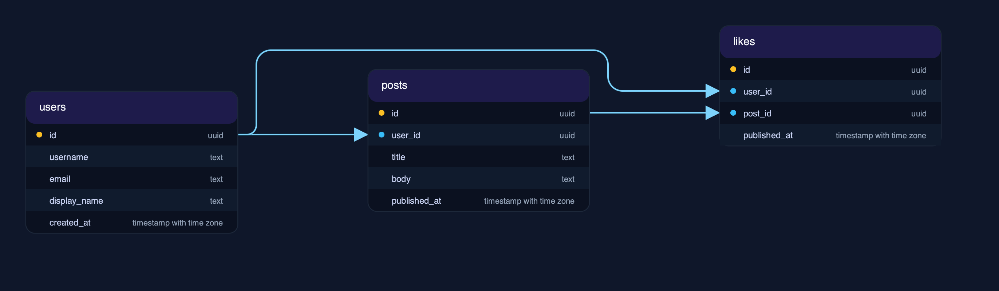
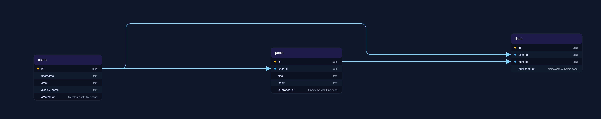

# Spacing Profiles

WizERD's auto-layout derives all routing and layering constants from a spacing profile. This ensures consistent, predictable results across different schemas.

## Available Profiles

### compact

```bash
wizerd generate schema.sql -o diagram.svg -w compact
```

Keeps tables closer together using smaller lane/lateral clearances. Best for:
- Quick prototypes
- Small schemas (under 20 tables)
- When you need a compact overview

### standard

```bash
wizerd generate schema.sql -o diagram.svg -w standard
```

The production default. Balanced readability without massive canvases. Best for:
- Most production use cases
- Medium schemas (20-50 tables)
- General documentation

### spacious

```bash
wizerd generate schema.sql -o diagram.svg -w spacious
```

Inflates table clearance, lane spacing, and ELK layer spacing. Best for:
- Large schemas (50+ tables)
- Team reviews
- When you need to trace complex relationships

## Comparison

| Aspect | Compact | Standard | Spacious |
|--------|---------|----------|----------|
| Table spacing | Tight | Medium | Generous |
| Lane spacing | Narrow | Medium | Wide |
| Entry margins | Small | Medium | Large |
| Canvas size | Smallest | Medium | Largest |
| Best for | Quick views | Production | Complex schemas |

## Visual Comparison

### Compact



### Standard


Uses default spacing (similar to sample-default-dark)

### Spacious



Notice how the relationships have more room to breathe in the spacious layout.

## How It Works

The spacing profile affects:

1. **ELK Layout Engine**
   - Layer spacing
   - Component spacing
   - Edge-to-node margins

2. **Post-processing Router**
   - Trunk offsets
   - Lane spacing
   - Entry margins

WizERD also implements a spacing feedback loop:
1. First layout pass with ELK
2. Check spacing constraints
3. If violations found: widen trunks/lanes, shrink entry zones
4. Re-run ELK with adjusted parameters
5. Repeat until constraints met or max iterations reached

This automatic adjustment handles most congestion automatically.

## Fine-grained spacing keys

In addition to the three presets (`compact`, `standard`, `spacious`) you can tune exact layout gaps using a `spacing` mapping in your config file or via environment variables. These keys map directly to layout measurements and give predictable control over horizontal canvas usage.

Key names (canonical):

- `column_gap` — Horizontal distance between table columns (affects X-axis spacing)
- `row_gap` — Vertical gap between tables in a column (affects Y-axis spacing)
- `component_gap` — Gap between disconnected groups of tables
- `edge_to_node_gap` — Clearance between edges and tables
- `edge_gap` — Clearance between parallel edges (lane spacing)
- `margin` — Canvas margin applied on both axes

Example: tighten up horizontal spacing and edge lanes in `.wizerd.yaml`:

```yaml
spacing:
  column_gap: 200.0
  edge_gap: 18.0
  margin: 32.0
```

## Tuning for tighter diagrams (practical tips)

If ELK appears to leave a lot of empty horizontal space around labels, try these, in order:

1. Use the `compact` preset: `-w compact` is the quickest way to shrink overall spacing.
2. Reduce `column_gap` (e.g. set to `200.0`) to bring columns closer together.
3. Reduce `edge_gap` (e.g. set to `18.0`) to tighten lanes between parallel edges.
4. Reduce `margin` if you want less canvas padding around the whole diagram.
5. If labels still seem oversized, consider disabling `--show-edge-labels` or adjusting label rendering (developer-level tweak: the label-width estimator lives in `wizerd/layout/engine.py` as `DEFAULT_EDGE_LABEL_CHAR_WIDTH`).

Small incremental changes are recommended — lowering gaps too far can increase edge crossings or cause ELK to reroute lines unexpectedly.
## Choosing a Profile

Start with `standard` for most use cases. Switch to:

- `compact` if you want smaller outputs
- `spacious` if you have many tables and relationships

You can always try multiple profiles to see which works best for your schema:

```bash
for profile in compact standard spacious; do
  wizerd generate schema.sql -o "diagram-$profile.svg" -w $profile
done
```

## Next Steps

- [Configuration](configuration.md) — Set default spacing in config
- [Examples](examples.md) — More command examples
- [CLI Reference](cli-reference.md) — Complete command reference
