# Themes

WizERD includes 13 built-in themes to match any aesthetic preference.

## List Available Themes

```bash
wizerd themes
```

Output:

```
Available themes:
  default-dark (dark) - Default dark theme with deep blue background
  dracula (dark) - Dracula color palette theme
  forest (dark) - Forest green theme
  hacker (dark) - Classic terminal green on black
  high-contrast (dark) - Accessibility-focused high contrast theme
  light (light) - Clean light theme with white background
  minimal (light) - Minimal black and white theme
  monochrome (dark) - High-contrast monochrome theme
  nord (dark) - Nord color palette theme
  ocean (dark) - Deep ocean blue theme
  solarized (dark) - Solarized color palette theme
  soft (light) - Soft neutral tones theme
  sunset (dark) - Warm sunset theme
```

## Theme Previews

### Dark Themes

#### default-dark


Default dark theme with deep blue background. Great for most use cases.

```bash
wizerd generate schema.sql -o diagram.svg
```

#### dracula

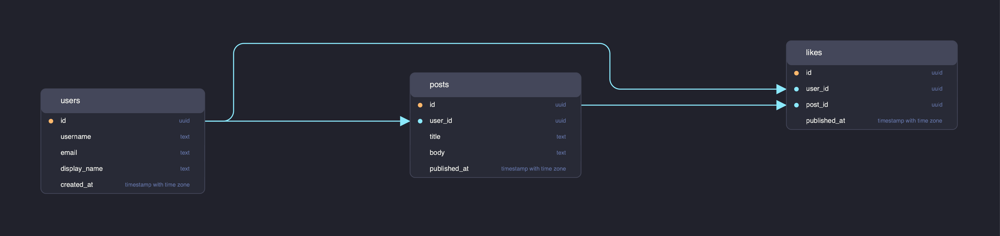

Vibrant purple and pink color palette.

```bash
wizerd generate schema.sql -o diagram.svg -t dracula
```

#### ocean

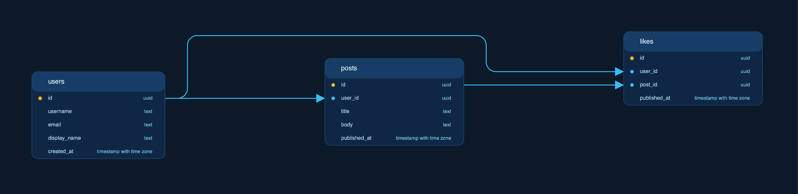

Deep ocean blue theme with cyan accents.

```bash
wizerd generate schema.sql -o diagram.svg -t ocean
```

#### forest

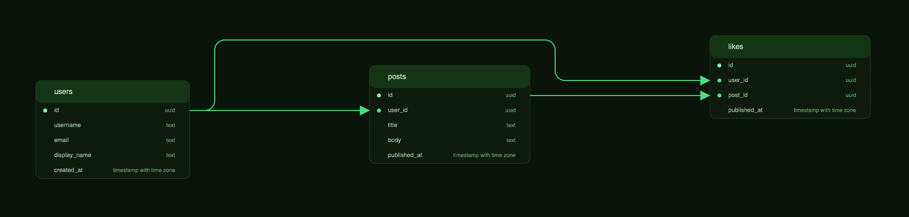

Green theme inspired by nature.

```bash
wizerd generate schema.sql -o diagram.svg -t forest
```

#### sunset

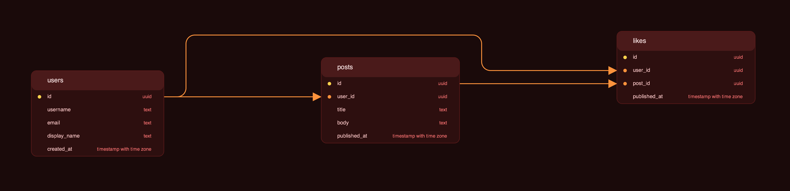

Warm sunset tones with orange and red.

```bash
wizerd generate schema.sql -o diagram.svg -t sunset
```

#### nord

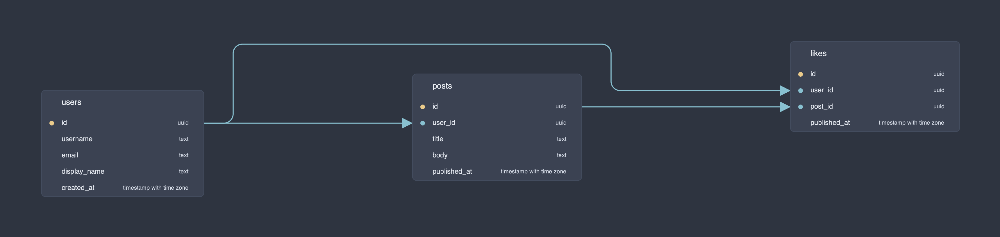

Arctic, north-bluish colors from the Nord color palette.

```bash
wizerd generate schema.sql -o diagram.svg -t nord
```

#### solarized

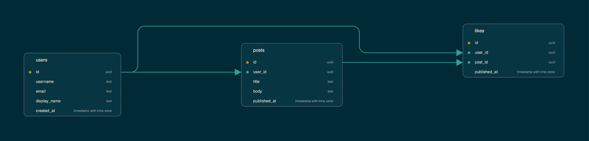

Precision colors from the Solarized color scheme.

```bash
wizerd generate schema.sql -o diagram.svg -t solarized
```

#### monochrome

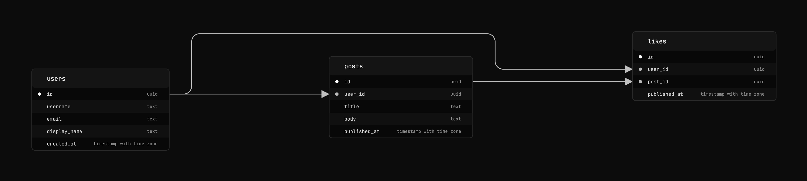

High-contrast black and white.

```bash
wizerd generate schema.sql -o diagram.svg -t monochrome
```

#### hacker

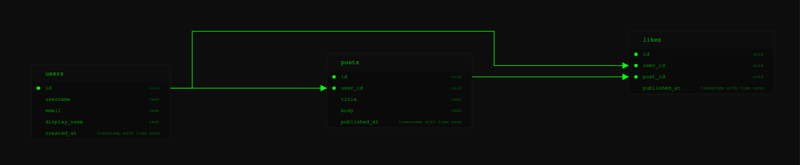

Classic terminal green on black.

```bash
wizerd generate schema.sql -o diagram.svg -t hacker
```

#### high-contrast

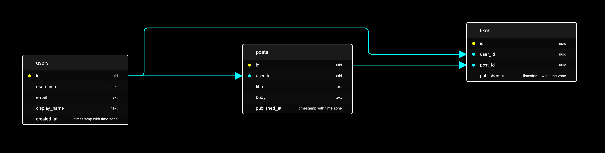

Maximum contrast for accessibility.

```bash
wizerd generate schema.sql -o diagram.svg -t high-contrast
```

### Light Themes

#### light

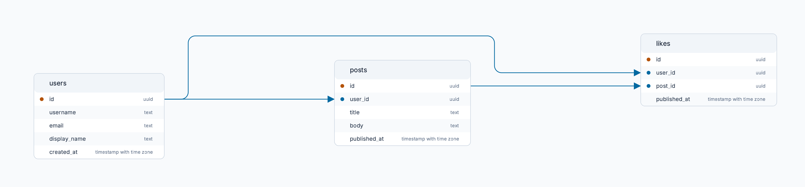

Clean white background for print-friendly output.

```bash
wizerd generate schema.sql -o diagram.svg -t light
```

#### minimal

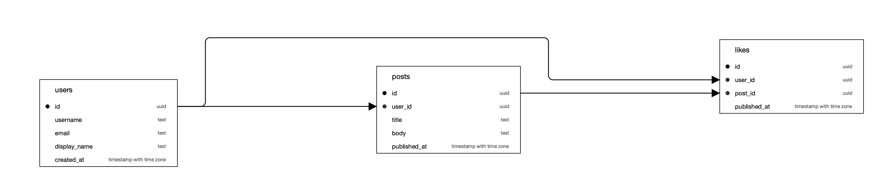

Pure black and white, perfect for documentation.

```bash
wizerd generate schema.sql -o diagram.svg -t minimal
```

#### soft

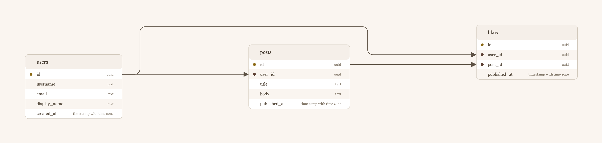

Neutral cream tones for a gentle appearance.

```bash
wizerd generate schema.sql -o diagram.svg -t soft
```

## Color by Trunk

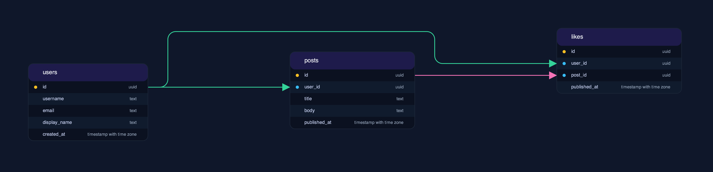

By default, all edges use a single color. Enable `color-by-trunk` to give each FK target a unique color:

```bash
wizerd generate schema.sql -o diagram.svg --color-by-trunk
```

This makes it easier to trace relationships to specific tables.

## Custom Themes

You can define custom themes or override specific theme variables directly in your config file. 

For a complete guide and reference to all available theme configuration properties, please see the [Theme Configuration](configuration.md#theme-configuration) section in the configuration documentation.

## Theme Selection Guide

| Use Case | Recommended Theme |
|----------|------------------|
| Default/general use | `default-dark` |
| Presentations | `light` |
| Print documentation | `minimal` |
| Dark mode interfaces | `dracula`, `nord` |
| Accessibility | `high-contrast` |
| Terminal aesthetic | `hacker` |
| Print-friendly | `light`, `minimal` |
